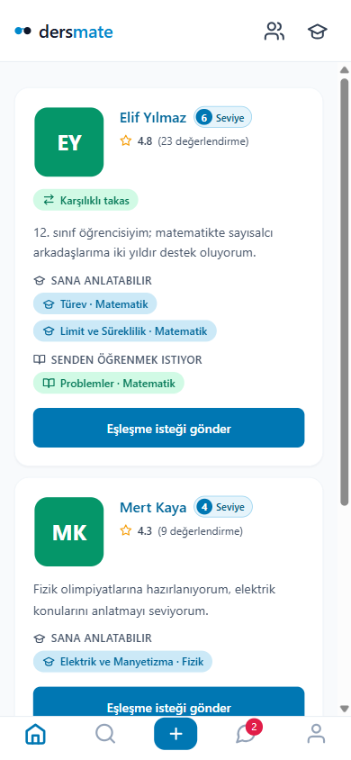
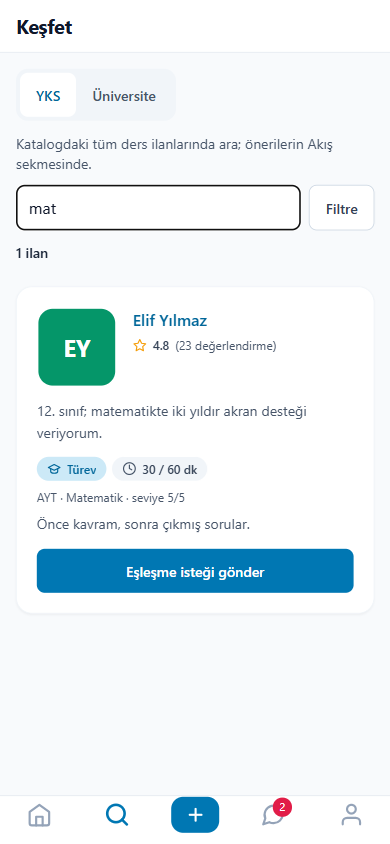
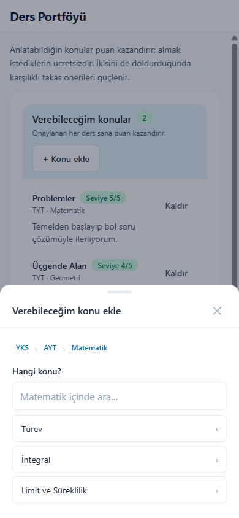
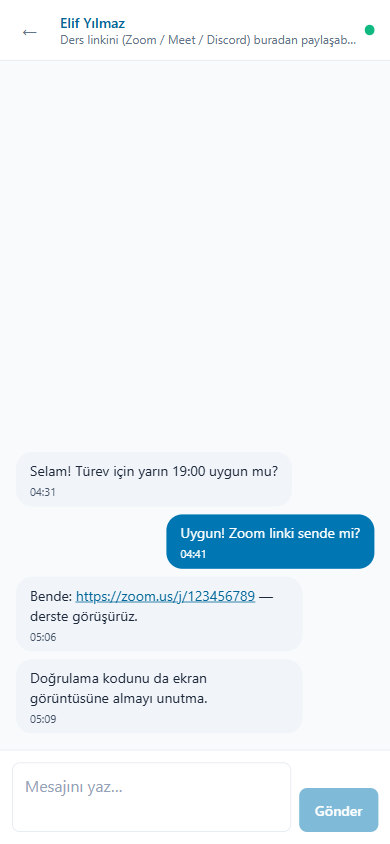
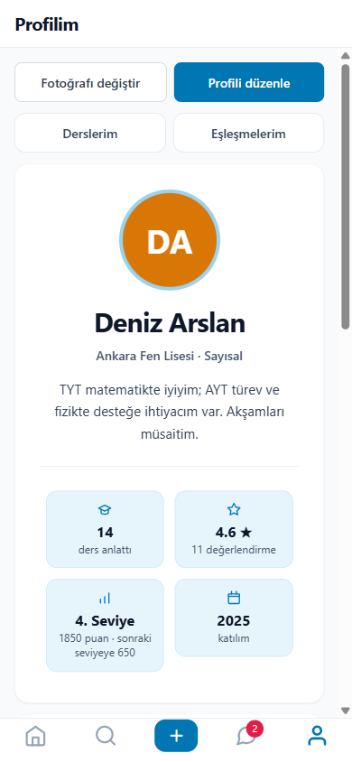
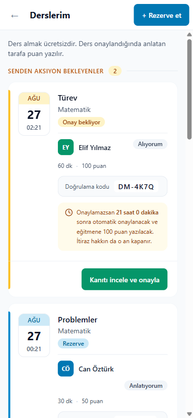
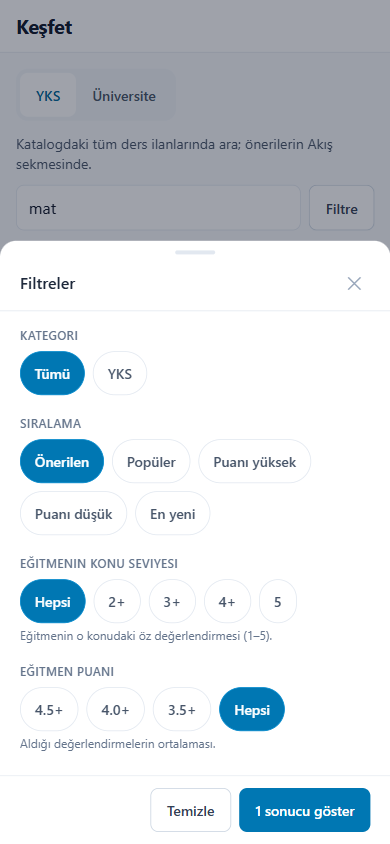
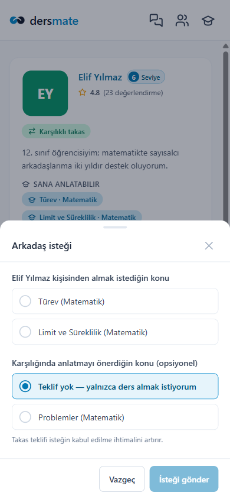

# dersmate mobil

**dersmate** akran öğrenme platformunun React Native (Expo) mobil istemcisi.

Öğrenciler birbirine ders verir: iyi olduğun konuyu anlatırsın, ihtiyacın olanı
**ücretsiz** alırsın. Para transferi yoktur — ders anlatan taraf puan kazanır, bu puan
harcanmaz, seviyeye dönüşür.

Bu depo **yalnızca mobil istemciyi** taşır. Backend (.NET 8 + PostgreSQL + SignalR) ve web
arayüzü ayrı projelerde yaşar; mobil tarafta hiçbir iş kuralı yeniden uygulanmaz, hepsi
sunucudan okunur.

---

## Ekranlar

Aşağıdaki görüntüler **demo modunda** alınmıştır (temsili veriler, sunucu bağlantısı yok).

| Topluluk | Keşfet | Konu seçici |
|---|---|---|
|  |  |  |
| Instagram düzeninde öneri kartları | Arama + TYT/AYT filtreleri | Sınav → TYT/AYT → Ders → Konu |

| Sohbet | Profil | Derslerim |
|---|---|---|
|  |  |  |
| SignalR canlı akış, ters liste | Branş rozetleri + değerlendirmeler | Takvim yaprağı, kanıt akışı, geri sayımlar |

| Filtre alt sayfası | Arkadaş isteği |
|---|---|
|  |  |

---

## Yığın

| | |
|---|---|
| Çatı | Expo SDK 57 · React Native 0.86 · React 19 |
| Gezinme | expo-router (dosya tabanlı, `Stack.Protected` guard'ları) |
| Stil | NativeWind 4 (Tailwind CSS) |
| Ağ | Axios · SignalR (`@microsoft/signalr`) |
| Depolama | expo-secure-store (oturum, HWID) · AsyncStorage (tercihler) |
| Dil | JavaScript — TypeScript **değil** |

> **Neden TypeScript değil:** web arayüzü de JavaScript ve bu proje ondan **birebir
> çeviriyle** besleniyor. Aynı dilde kalmak, bir sayfayı mobile taşırken çağrıların ve
> mantığın değişmeden aktarılmasını sağlıyor.

---

## Kurulum

```bash
npm install
```

Geliştirme sunucusunu başlat:

```bash
npx expo start
```

Telefonda **Expo Go** ile QR'ı okut ya da `npx expo start --android` ile emülatörde aç.

### Backend'e bağlanmak

API'nin LAN'dan erişilebilir olması gerekir — varsayılan `localhost` telefondan görünmez:

```bash
dotnet run --project src/PeerLearn.Api --urls http://0.0.0.0:5000
```

Adres ayarı **gerekmez**: `src/lib/api.js` geliştirmede bilgisayarın LAN IP'sini Metro'nun
`hostUri` değerinden kendisi türetir. Başka bir ortam (staging, üretim, farklı ağ) için:

```bash
cp .env.example .env
# EXPO_PUBLIC_API_URL=http://sunucu-adresi:5000
```

---

## Demo modu (sunucusuz önizleme)

Backend olmadan tüm ekranları gezmek için:

```bash
npx cross-env EXPO_PUBLIC_ONIZLEME=1 expo start
```

Bu bayrak açıkken `api.*` yüzeyi sunucuya hiç gitmez; yanıtlar
[`src/lib/onizleme.js`](src/lib/onizleme.js) içindeki temsili verilerden gelir ve sahte bir
oturum açık başlar. Alan adları backend yanıtlarıyla birebirdir, yani demo modunda çalışan
bir ekran gerçek sunucuda da aynı alanları okur. Normal derlemede bu modül ölü koddur.

Tarayıcıda önizleme için:

```bash
npm run web:onizleme
```

---

## APK derleme

### Yerel (hesap gerekmez)

Gereksinimler: JDK 17 ve Android SDK (platform 36, build-tools 36). `android/local.properties`
içine SDK yolunu **eğik bölüyle** yaz — Java `.properties` biçiminde ters bölü kaçış
karakteridir ve `C:\Android\Sdk` sessizce `C:AndroidSdk`'ya dönüşür:

```
sdk.dir=C:/Android/Sdk
```

Sonra:

```bash
npx expo prebuild --platform android
```

```bash
cd android && ./gradlew assembleRelease
```

Çıktı: `android/app/build/outputs/apk/release/app-release.apk`

> Release derlemesi React Native şablonunun **debug keystore**'uyla imzalanır — kurulum için
> yeterlidir, Play Store için değil.

### EAS Build (bulut)

[`eas.json`](eas.json) üç profil taşır:

| profil | çıktı |
|---|---|
| `onizleme` | Demo APK — sunucu gerekmez, doğrudan kurulur |
| `preview` | Gerçek APK — `EXPO_PUBLIC_API_URL` adresindeki backend'e bağlanır |
| `development` | Geliştirme istemcisi — Expo Go'nun yerini alır, Metro'ya bağlanır |

```bash
npx eas-cli build --profile onizleme --platform android
```

---

## Klasör yapısı

```
app/                      expo-router rotaları
  (auth)/                 giriş · kayıt · e-posta doğrulama
  index.jsx               Topluluk — ana ekran
  kesfet.jsx              Keşfet (varsayılan kip: öneriler)
  olustur.jsx             Ders Portföyü
  mesajlar.jsx            Sohbet listesi
  profil/index.jsx        Profilim
  dersler.jsx             Derslerim (kendi geri şeridi var)
  eslesmeler.jsx          Arkadaşlar (rota adı bilerek eski)
  yonetim.jsx             moderasyon kuyrukları
  profil/[userId].jsx     başkasının profili
  sohbet/[conversationId].jsx   konuşma ekranı
  +not-found.jsx          bilinmeyen adres → Keşfet (web'in path="*" karşılığı)
src/
  components/             yüzey dili (ui.jsx), kartlar, modallar, ikonlar
  lib/                    api · tema · depolama · biçimlendirme · HWID · demo verisi
  state/                  AuthContext · InboxContext (SignalR) · WalletContext
  hooks/                  useChatHub · useDebounced
```

Gezinme **soldaki çekmecededir** — alt sekme çubuğu yoktur. Sol üstteki hamburgere
dokununca web'in sol rayının birebir karşılığı açılır: Keşfet · Ders Portföyü ·
Arkadaşlar · Sohbet · Derslerim · Topluluk (yöneticide ayrıca Yönetim). Okunmamış mesaj
sayısı hamburgerin üstünde rozet olarak durur.

Ana ekran **Topluluk**'tur. Ekranların hepsi kök yığındadır ve `dangerouslySingular`
taşır: çekmeceden gezinmek yığını büyütmez, açık olan ekranı en üste taşır — biriken
sayfalar ve kaydırma yeri korunur.

---

## Korunan iş kuralları

Bunlar sunucuda yaşar; arayüzün görevi ihlal etmemektir.

1. **Ders almak ücretsizdir.** Kredi düşme veya harcama arayüzü **yoktur**. Puan yalnızca
   anlatana basılır (30 dk = 50, 60 dk = 100) ve harcanmaz — seviye unvanıdır.
2. **Seviye ve rozet hesabı sunucudadır.** `seviye.js` eşik tablosu taşımaz; `level` ve
   `nextLevelAt` hazır gelir. Branş rozetleri de öyle: Öğretici (8 saat) ve Üstad (15 saat)
   kademelerini `SubjectBadgeEngine` belirler, istemci yalnızca çizer.
3. **SignalR tek bağlantı.** Sağlayıcılar kökte kurulur; sohbet ekranı kendi hub'ını
   **açmaz**. İki bağlantı, gruba katılmayı böler ve mesaj kaybettirir.
4. **Ders geçmişi 5'erli sayfalarla** `FlatList onEndReached` ile birikir (mobil kuralı;
   web 20 kullanır ve sayfa değiştirir).
5. **Kanıt zorunludur.** Ders, `expo-image-picker` ile yüklenen ekran görüntüsü ve
   doğrulama koduyla kapanır; puan ancak karşı taraf onayladığında basılır.

---

## Web projesiyle ilişki

Tek yönlü çeviri: web değişir, mobil takip eder.

- **`api.*` yüzeyi web'dekiyle aynı tutulur.** Bir sayfa mobile çevrilirken çağrılar
  değişmeden taşınır. Yeni uç eklenirse iki projede birden eklenir.
- **Marka paleti** web'in `tailwind.config.js`'inden birebir kopyadır. `#0088CC` bilerek
  500 basamağındadır: üzerine beyaz metin 3.89:1 verir ve WCAG AA eşiği 4.5:1'dir; buton
  zeminleri bu yüzden 600 (4.90:1) ve 700'den (6.25:1) gelir.
- **`format.js`, `seviye.js`, `useAsync.js`, `useDebounced.js` birebir kopyadır** — saf JS,
  platform bağımsız.
- **HWID mobilde ayrı üretilir** (`src/lib/hwid.js`): canvas yoktur, cihaz kimliği
  expo-application/device sinyallerinden gelir. Web'in canvas sabitleri buraya taşınmaz —
  HWID cihazı tanımlar, kullanıcıyı değil.

### Bilinçli sapmalar

| web | mobil | neden |
|---|---|---|
| `localStorage` | SecureStore + AsyncStorage | token gibi bir sırrı düz dosyaya yazmamak |
| blob / object URL | `<Image source={{uri, headers}}>` | RN'de `URL.createObjectURL` yok |
| giriş sonrası `navigate` | `Stack.Protected` guard'ı | yönlendirmeyi tek yerde tutmak |
| numaralı sayfalama | sonsuz kaydırma | sayfa düğmesi başparmağa ters |
| hover durumları | `active:` durumları | dokunmatikte hover yok |

Dokunma kuralları web'de `lg` kırılımına bağlıydı; mobilde **koşulsuzdur**: basılabilir her
öğe en az 44px, girdi puntosu 16px.

---

## Geliştirme notları

Projeye özgü kurallar, tuzaklar ve karar gerekçeleri [`CLAUDE.md`](CLAUDE.md) dosyasındadır.
Bir şeyi "düzeltmeden" önce oradaki gerekçeyi okumakta fayda var — birçok tuhaf görünen
karar ölçülmüş bir nedene dayanıyor.

```bash
npx expo export --platform android   # cihazsız derleme sağlaması
```

---

## Lisans

Bu depoda lisans dosyası **bilerek yoktur**: kod tüm hakları saklı olarak yayınlanmıştır.
Görüntülenebilir, ancak izin alınmadan kullanılamaz, çoğaltılamaz veya dağıtılamaz.

> Şablonla gelen MIT lisansı kaldırıldı — telif satırı Expo'yu (650 Industries) gösteriyordu
> ve bu kodun sahipliğini yanlış anlatıyordu.
